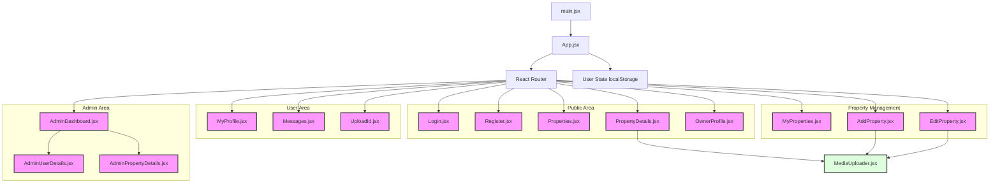

# DreamStay Frontend Architecture Diagram

# Frontend Concept Map

- **App.jsx**: Main entry point handling Routing and Global User State (via `localStorage`).
- **Pages**:
    - **Public**: Login, Register, Property Listing, Property Details.
    - **Admin**: Dashboard for verification and user management.
    - **User/Seller**: My Profile, My Properties, Messages, ID Verification.
- **Components**:
    - **MediaUploader**: Reusable component for handling image and video uploads.
